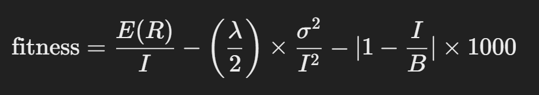
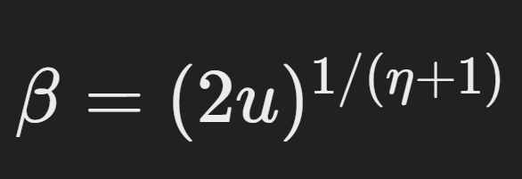
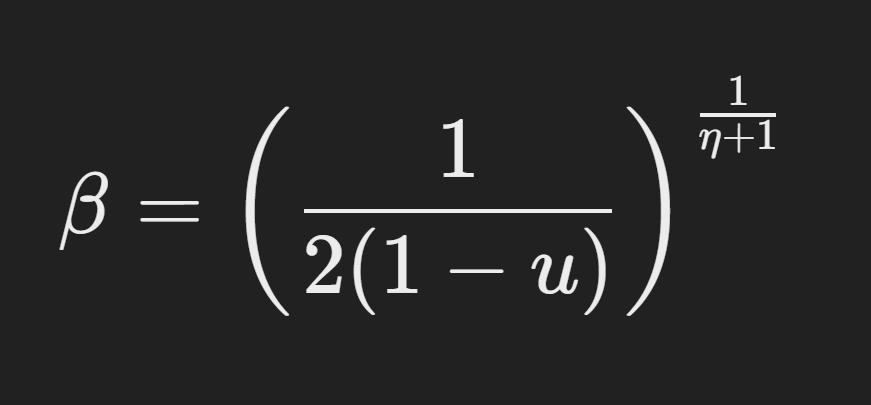
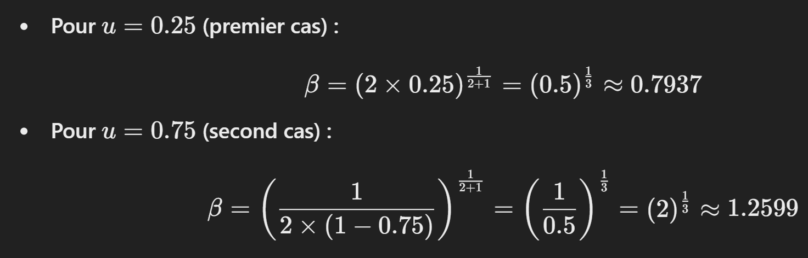
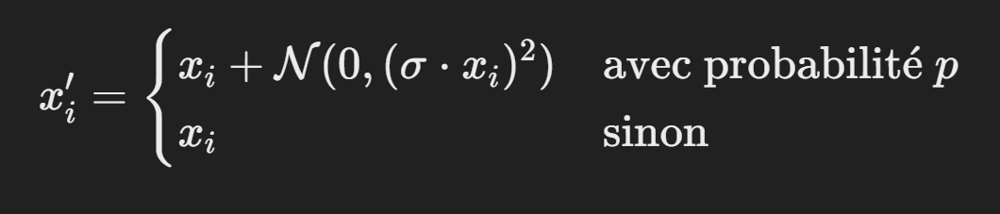

# Optimisation de Portefeuille avec Algorithme Génétique

Ce projet implémente un algorithme génétique pour optimiser un portefeuille selon le modèle de Markowitz, en utilisant une fonction d'utilité quadratique. Différentes techniques d'optimisation ont été implémentées, telles que la sélection par tournoi avec élitisme, le Simulated Binary Crossover (SBX), et la mutation gaussienne avec normalisation. 

L'algorithme permet d'équilibrer le rendement espéré du portefeuille et le risque associé en fonction d'une aversion au risque donnée.

### Se référer à /docs/docs.md pour plus de détails sur les algorithmes génétiques

# Implémentation de l'algorithme génétique TEAM 157

Voici les différentes méthodes que nous avons choisis pour les différentes étapes de notre algorithme génétique.

## 1. Initialisation de la population 

Soit $n$ le nombre d'actions disponible dans le portefeuille
Soit $p$ le prix de l'action
Soit $B$ le budget définie

Pour chaque portefeuille de la population (chaque portefeuille étant une combinaison d'actions et de quantités), on génère un vecteur de $n$ valeurs aléatoires uniformes $si ∈ [0,1]$.

Ensuite, pour toutes ces valeurs aléatoires 

$si = B/pi$ --> Ces valeurs sont multipliées par la limite maximale de parts pouvant être achetées pour chaque action i dans la limite du budget. 

Les valeurs sont ensuite arrondies vers le bas (fonction plancher) pour garantir que le nombre de parts achetées est un nombre entier.

A l'initialisation, le budget du portefeuille peut donc dépasser le budget total, cependant ce n'est pas grave car la fonction objective pénalise le dépassement de budget. Ainsi, au fur et à mesure le budget va converger vers le budget souhaité. 
Cela permet de garder un portefeuille initiale le plus aléatoire possible.

## 2. Fonction fitness
Une fois la population de portefeuilles générée on peut calculer pour chacun d'entre eux leurs fonctions fitness.
La fonction fitness des portefeuilles est calculée comme cela :

## 3. Fonction évolutive

La fonction évolutive est très simple :

On boucle tant que la fonction fitness du meilleur portefeuille n'est pas supérieur à l'objectif final.

A chaque itération : 

    - On sélectionne les portefeuilles pour la génération suivante
    - On effectue les croisements sur les portefeuilles issus de la génération par tournoi. 
    - On effectue la mutation sur les enfants de portefeuilles issus de la génération par tournoi. 

## 4. Sélection par élitisme et par tournoi

La sélection des portefeuilles se fait en deux étapes : 

1) Elitisme : consiste à garder les 10% meilleurs portefeuilles de la génération, sans y toucher. 

2) Sélection par tournoi : pour les 90% restants, on sélectionne les parents par un tournoi. On prend au hasard 3 portefeuille de la génération actuelle et on sélectionne les 2 meilleurs parmis les 3 pour être des parents. 

## 5. Croisement
Après avoir sélectionnés les couples de parents, pour chaque couple on croise les deux portefeuilles comme ceci : 

ETA (𝜂) est l'indice de distribution du croisement (𝜂 élevé réduit la dispersion des enfants)

On boucle sur chaque actions : 
    On génère un nombre aléatoire U entre 0 et 1.
    La nouvelle part est calculée comme une moyenne pondérée des parts entre les 2 parents

    Formule part_enfant
    $child_share=0.5*((1+β)*self.shares[i]+(1-β)*other.shares[i])$

    $(1+β)*parent1_share -> pondère la partie du premier parent
    $(1-β)*parent2_share -> pondère la partie du 2e parent

    Donc, si β proche 1 on se rapproche du 1er parent, β proche de 0 du 2e et β proche de 0.5 contribution équilibré des 2 parents.

    La nouvelle part dépend donc du paramètre Beta calculé comme suit : 
    Si u<=0.5 :
    
    Explication : 
    On multiplie par 2u pour transformer l'intervalle [0, 0.5] en [0,1] -> normaliser u
    Exponentiation par 1/(𝜂+1) -> contrôler la courbe de distribution

    Si u>0.5 :
    
    Cette fois-ci on normalise de [0.5, 1] en [0, 1] avec 2(1-u)

    Exemple d'une application numérique
    

    Dans cet exemple, les valeurs de 𝛽 u=0.25 u=0.75 sont des inverses approximatifs l'une de l'autre, illustrant la symétrie autour de la moyenne. 

## 6. Mutation

On applique ensuite aux enfants formés la mutation comme ceci : 
On définie la probabilité de mutation à 10%
On définie sigma à 0.1 (écart type pour la perturbation gaussienne)

On boucle sur chaque part du portefeuille créé :
    On applique la perturbation gaussienne si sélectionnée
    

    On vérifie que les parts ne sont pas négatives
    On conserve la proportion relative de chaque part en respectant le budget